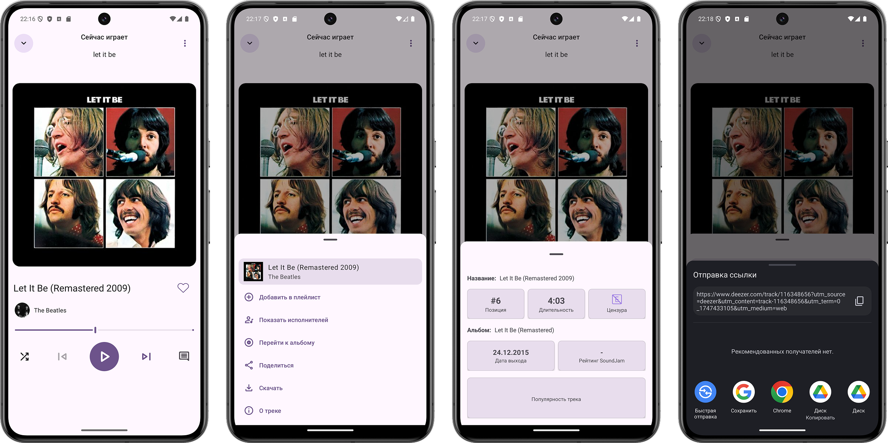
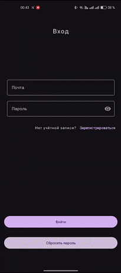
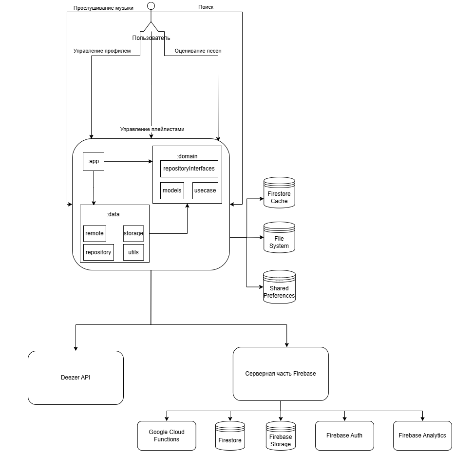
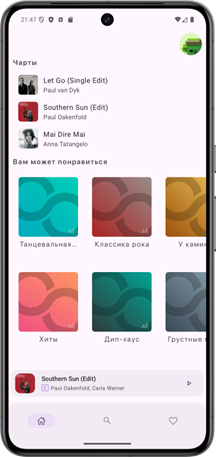
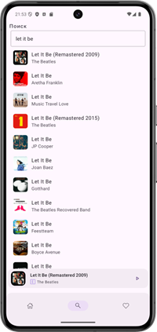
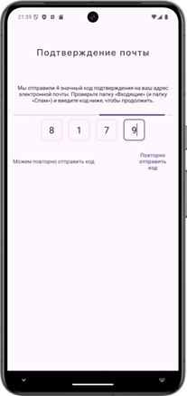
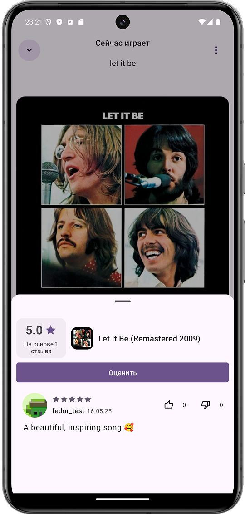
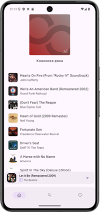
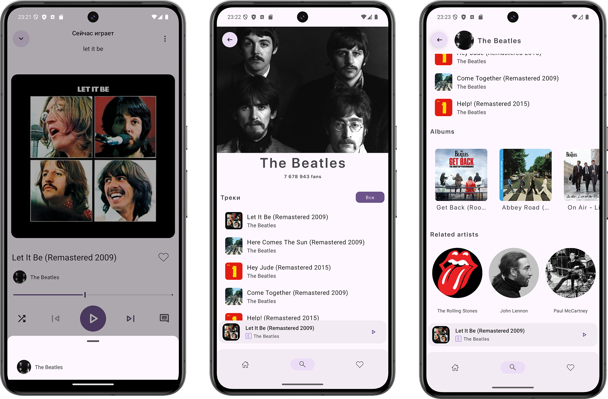

# 🎵 SoundJam

<p align="center">
  
  
  
  
  
</p>

<p align="center">
  Android-приложение для прослушивания музыки с пользовательскими рейтингами, рецензиями и плейлистами.
</p>

<p align="center">
  
</p>

## 📱 About

SoundJam представляет собой клиент-серверное Android-приложение для поиска и прослушивания музыкальных композиций.

Помимо стандартного музыкального плеера приложение добавляет социальную составляющую: пользователь может оценивать композиции, оставлять рецензии и просматривать оценки других пользователей. На основе пользовательских оценок формируется общий рейтинг музыкальных композиций.

Музыкальный контент и метаданные получаются через Deezer API, а пользовательские данные синхронизируются с Firebase.

## 🎬 Demo

<p align="center">
  
</p>

## ✨ Features

- 🎵 Прослушивание музыкальных композиций
- 🔎 Поиск музыки по названию
- 📈 Просмотр музыкальных чартов и подборок
- 🎤 Просмотр страниц артистов и их дискографии
- ⭐ Оценка композиций от 0.5 до 5.0
- 💬 Создание пользовательских рецензий
- 📊 Просмотр среднего рейтинга и оценок других пользователей
- 📚 Создание и управление пользовательскими плейлистами
- 👤 Регистрация, авторизация и управление профилем
- 🔐 Восстановление доступа к аккаунту
- 🌙 Изменение темы приложения
- ⬇️ Загрузка музыки для офлайн-прослушивания
- 🎧 Фоновое воспроизведение и управление музыкой при заблокированном экране

## 🎧 Player

Плеер построен на Jetpack Media3 и ExoPlayer.

Воспроизведение вынесено в MediaSessionService, благодаря чему музыка продолжает играть в фоне и при переходе пользователя между экранами приложения.

Отдельный PlayerManager отвечает за состояние плеера, текущий трек, очередь воспроизведения, позицию, переход между композициями и режим повтора. Состояния различных частей плеера объединяются через Kotlin Flow.

При завершении работы AudioPlayerService освобождает ExoPlayer и MediaSession и очищает очередь воспроизведения.

## ⭐ Rating system

Одной из основных особенностей приложения является система пользовательских оценок.

Пользователь может открыть экран рецензий непосредственно из плеера, выставить оценку от 0.5 до 5.0 и дополнительно оставить текстовый отзыв.

Рецензия отправляется на сервер через Firebase Cloud Functions. После добавления новой оценки сервер пересчитывает средний рейтинг композиции и количество отзывов. Обновленные данные сразу отображаются в клиентском приложении.

## 🏗 Architecture

Приложение построено с использованием Clean Architecture и MVVM.

<p align="center">
  
</p>

Структура Android-клиента разделена на три основных модуля.

### app

UI приложения, ViewModel, навигация и связывание остальных компонентов системы.

### domain

Бизнес-модели, интерфейсы репозиториев и основная бизнес-логика приложения.

### data

Работа с Deezer API, Firebase, локальными источниками данных и реализации интерфейсов из domain.

Такое разделение уменьшает связанность компонентов и позволяет независимо изменять источники данных, UI и бизнес-логику.

## 🔄 Data flow

```text
User
 ↓
UI / Fragment
 ↓
ViewModel
 ↓
Domain
 ↓
Repository
 ↓
Data Source
 ↓
Deezer API / Firebase / Local Storage
```

Полученные данные проходят обратный путь и отображаются пользователю через UI.

## ☁️ Backend

Серверная часть построена на Firebase и Firebase Cloud Functions.

Cloud Functions реализованы на Python и содержат серверную бизнес-логику приложения. Сервер отвечает за работу с пользовательскими профилями, проверку уникальности данных, создание рецензий и пересчет рейтингов.

Используются:

- Firebase Authentication для регистрации и авторизации пользователей
- Cloud Firestore как основная NoSQL база данных
- Firebase Storage для хранения пользовательских файлов и аватаров
- Firebase Cloud Functions для выполнения серверной бизнес-логики
- Firebase Analytics для анализа работы приложения

## 🗄 Data

В Firestore хранятся пользовательские данные приложения: профили, плейлисты, оценки и рецензии.

Основные сущности:

- User
- Track
- Playlist
- PlaylistTrack
- Review
- ReviewReaction

Также хранятся агрегированные показатели композиции, например средняя пользовательская оценка и количество рецензий.

## 🌐 Network

Для получения музыкального контента приложение напрямую взаимодействует с Deezer API.

Retrofit используется для описания REST API, а OkHttp отвечает за выполнение HTTP-запросов.

Для JSON-сериализации используется Gson.

## 💾 Local storage

Для разных типов локальных данных используются разные механизмы.

SharedPreferences хранит небольшие пользовательские настройки и историю поиска.

Firestore Offline Cache позволяет работать с локальными копиями документов и синхронизировать изменения после восстановления соединения.

Файловая система Android используется для хранения загруженных аудиофайлов.

## 🖼 Images

Для загрузки и кэширования обложек музыкальных композиций, альбомов и изображений артистов используется Glide.

## 🧭 Navigation

Навигация между экранами реализована с помощью Android Jetpack Navigation Component.

## 🛠 Tech Stack

### Android

- Kotlin
- Android SDK
- Android Views / XML
- MVVM
- Clean Architecture
- Kotlin Coroutines
- Kotlin Flow
- ViewModel
- Jetpack Navigation

### Media

- Jetpack Media3
- ExoPlayer
- MediaSession
- MediaSessionService

### Network

- Retrofit
- OkHttp
- Gson
- Deezer API

### Backend

- Python
- Firebase Cloud Functions
- Firebase Authentication
- Cloud Firestore
- Firebase Storage
- Firebase Analytics

### Storage

- SharedPreferences
- Firestore Offline Cache
- Android File System

### UI

- Android Views
- Glide
- Figma

## 📂 Project structure

```text
MusicApp/
├── app/
├── data/
├── domain/
├── gradle/
├── app.puml
├── data.puml
├── dataModule.puml
├── data_remote_models.puml
├── domain.puml
├── domainModule.puml
├── domain_models.puml
├── uiModule.puml
├── ui_viewModel.puml
├── build.gradle.kts
├── settings.gradle.kts
└── gradle.properties
```

## 📸 Screenshots

<p align="center">
  
  
  
</p>

<p align="center">
  
  
  
</p>

## 🧪 Testing

В рамках разработки проведено функциональное тестирование основных пользовательских сценариев:

- регистрация и авторизация
- главный экран
- поиск
- воспроизведение музыки
- выставление оценок
- взаимодействие с серверными данными

## 📱 Requirements

Android 8.1 Oreo или выше.

## 🎯 Purpose

Проект разработан в рамках выпускной квалификационной работы по направлению «Программная инженерия».

Основной целью было разработать полноценное Android-приложение для прослушивания музыки и дополнить классический музыкальный сервис социальной системой оценок и пользовательских рецензий. =)

## 👨‍💻 Author

Fedor Shmakov
